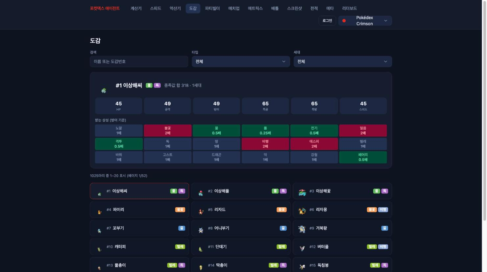

# 1편 — 왜 만들었나, 그리고 도메인 파운데이션

## 만들게 된 이유

포켓몬 챔피언스의 싱글배틀을 분석하는 개인 도구가 필요했다. 데미지 계산, 스피드 비교,
상대 파티에 대한 선출·대비책 같은 것을 매번 머리로 굴리는 대신 한곳에서 처리하고 싶었고,
거기에 Claude를 붙여 "이 파티의 약점은 무엇인가" 같은 질문에 답하게 만들고 싶었다.

처음에는 9세대 SV(스칼렛·바이올렛) 기준으로 시작했다. 그런데 대상 게임이 포켓몬 챔피언스로
바뀌면서 설계의 전제가 흔들렸다. 챔피언스는 SV 메커니즘을 기반으로 하되 메가진화와 테라스탈이
공존하고, 무엇보다 **노력치 체계가 다르다.** 본가의 0~252 EV가 아니라 스탯당 0~32 포인트
시스템이다. 그리고 Pokémon Showdown이나 PokeAPI는 챔피언스를 다루지 않는다. 기존 도구나
데이터를 그대로 가져다 쓸 수 없다는 뜻이었다.

이 피벗은 단순한 숫자 교체가 아니었다. 데미지 공식, 데이터 검증 스키마, 파티 입력 UI까지
전부 0~32 전제로 다시 맞춰야 했다. 그래서 첫 단추를 도메인 계층에 단단히 끼우는 데서 시작했다.

## 모노레포 골격

구조는 pnpm 워크스페이스 + turbo로 잡았다.

```
pokedex-agent/
├── apps/
│   ├── client/        React + Vite 웹앱
│   └── server/        게이트웨이 (이후 NestJS로 전환)
├── packages/
│   ├── pokedex-core/  결정론적 도메인 라이브러리 (데이터·공식·타입)
│   ├── battle-engine/ 배틀 상태·데미지 계산 엔진
│   └── data-fetchers/ PokeAPI 수집 스크립트
```

핵심은 `pokedex-core`다. 데이터·공식·타입을 모은 결정론 라이브러리로, 같은 입력에 항상 같은
출력을 낸다. AI나 네트워크가 끼어들지 않는 순수 계산 영역을 여기에 모아두면 테스트가 쉽고,
나중에 서버든 클라이언트든 모바일이든 같은 로직을 공유할 수 있다.

## 데이터는 손으로 입력하지 않는다

도감·기술·특성·도구·타입·성격 데이터는 전부 `data-fetchers`가 PokeAPI에서 수집해 JSON으로
떨군다. 하드룰을 하나 정했다. **데이터는 한 글자도 손으로 입력하지 않는다.** 오타나 임의
보정이 끼어들 여지를 처음부터 차단하기 위해서다. 1025마리 도감을 수집했고, 한국어명 누락은
0건이었다. 수집된 항목 하나의 실물은 이렇게 생겼다 — 한국어명·영문 슬러그·타입·종족값이
한 레코드다.

```json
{
  "no": 445,
  "ko": "한카리아스",
  "en": "garchomp",
  "generation": 4,
  "types": ["드래곤", "땅"],
  "base": { "H": 108, "A": 130, "B": 95, "C": 80, "D": 85, "S": 102 }
}
```

이 위에 조회 계층을 얹었다. 정확한 이름 매칭과 별개로, 오타가 섞인 입력도 가장 가까운
이름으로 이어주는 퍼지 검색이다. 편집 거리(레벤슈타인)를 한국어명·영문명 양쪽에 대해 재서
가장 가까운 후보를 돌려준다.

```ts
// packages/pokedex-core/src/lookup.ts
export const fuzzyPokemon = (query: string, limit = 5): PokedexEntry[] =>
  pokedex.entries
    .map((e) => ({ entry: e, score: Math.min(editDistance(query, e.ko), editDistance(query, e.en)) }))
    .sort((a, b) => a.score - b.score)
    .slice(0, limit)
    .map((x) => x.entry);
```

그리고 같은 파일에서, 수집한 네 사전(종족·기술·특성·도구)의 한국어명을 합쳐 "검증된 명칭
집합"을 만들어두었다. 이때는 단순한 유틸이었는데, 나중에 AI가 한국어 이름을 지어내는 문제
(3편)를 잡는 핵심 방어선이 된다.

이 원칙은 나중에 실제로 값을 했다. 데이터가 틀렸을 때 "코드를 고치고 다시 수집한다"가
"손으로 고친다"보다 항상 우선이라는 기준이 분명했기 때문이다. (그 사례는 6편에서 다룬다.)

이렇게 수집한 데이터가 화면에서 어떻게 보이는지는 도감 페이지가 잘 보여준다. 1025마리
전부 한국어명·타입·종족값·방어 상성이 데이터에서 그대로 렌더링된다. 한 글자도 손으로
입력하지 않았기 때문에, 화면에 보이는 모든 글자는 수집 코드의 산출물이다.



## 공식: 0~32 노력치를 본가 공식에 끼우기

실수치 계산이 가장 먼저 발목을 잡는 지점이었다. 본가 능력치 공식은 노력치를 0~252로 받는데,
챔피언스는 0~32다. 다행히 두 체계는 선형으로 매핑된다. 본가 공식의 노력치 기여분(0~63)에
대응시키면 챔피언스 포인트 1점이 본가 EV 2에 해당한다.

```ts
export const actualStat = ({ stat, base, iv, ev, level, nature }: ActualStatInput): number => {
  // ev는 챔피언스 노력 포인트(0~32). 본가 공식의 evComponent(0~63)와 매핑하면 ev * 2다.
  const evComponent = ev * 2;
  if (stat === 'H') {
    if (base === 1) return 1; // 껍질몬: HP 종족값 1은 항상 1
    return Math.floor(((2 * base + iv + evComponent) * level) / 100) + level + 10;
  }
  const before = Math.floor(((2 * base + iv + evComponent) * level) / 100) + 5;
  return Math.floor(before * natureMultiplier(stat, nature));
};
```

데미지 공식은 SV 메커니즘을 그대로 따랐다. SV 데미지는 4096 기반 고정소수점 모디파이어와
반내림(pokeRound)을 쓰는데, 이걸 정확히 재현해야 "확정 2타"인지 "난수 2타"인지가 갈린다.

```ts
const pokeRound = (n: number): number => (n - Math.floor(n) > 0.5 ? Math.ceil(n) : Math.floor(n));
const applyMod = (damage: number, mod: number): number => pokeRound((damage * mod) / 4096);
```

자속 보정도 테라스탈 때문에 단순하지 않다. 원래 자속과 테라 타입이 겹치면 2.0배, 한쪽만이면
1.5배, 스텔라 테라는 또 다른 규칙이다. 이런 분기를 4096 기반 정수 모디파이어로 공식 안에
명시적으로 박아두었다. 실제 구현이다.

```ts
// packages/pokedex-core/src/formula/damage.ts
const stabMod = (input: DamageInput): number => {
  const isOriginalStab = input.attackerTypes.includes(input.moveType);
  const tera = input.attackerTerastalized ? input.attackerTeraType : undefined;

  if (tera === '스텔라') {
    return isOriginalStab ? 8192 : 4915; // 자속 2.0, 비자속 1.2
  }
  if (tera) {
    const isTeraStab = input.moveType === tera;
    if (isTeraStab && isOriginalStab) return 8192; // 테라 자속 + 원본 자속 = 2.0
    if (isTeraStab || isOriginalStab) return 6144; // 한쪽만 자속 = 1.5
    return 4096;
  }
  return isOriginalStab ? 6144 : 4096;
};
```

스피드도 같은 방식으로 한 함수에 모았다. 랭크 배율 → 도구 배율 → 특성 배율 순으로 매번
내림하고, 끈적네트·마비·순풍을 마지막에 적용한다. 적용 순서와 내림 위치가 틀리면 실수치가
1 어긋나고, 스피드 1 차이는 선공이 뒤집히는 문제라 대충 곱해선 안 된다.

```ts
// packages/pokedex-core/src/formula/speed.ts
export const effectiveSpeed = (input: SpeedInput): number => {
  let value = Math.floor(base * rankMultiplier(rank));
  value = Math.floor(value * itemMultiplier);     // 구애스카프 1.5, 두꺼운자루 0.5 등
  value = Math.floor(value * abilityMultiplier);  // 가속 1.5, 모래헤치기 2.0 등
  // 끈적네트는 스피드 1랭크 다운(= 2/3배), 1/3배가 아니다.
  if (stickyWeb) value = Math.floor((value * 2) / 3);
  if (paralyzed) value = Math.floor(value / 2);
  if (tailwind) value *= 2;
  return value;
};
```

트릭룸까지 고려한 "누가 먼저 움직이나"의 최종 판정도 도메인 함수다. UI는 이 결과를 그릴
뿐 비교 로직을 갖지 않는다.

여기에 타입 상성과 16가지 난수 롤까지 더해 결정론 계산기의 토대를 만들었다.

## 검증을 먼저

공식은 틀리면 조용히 틀린다. 그래서 데미지 계산에 대해 30개 케이스의 fixture를 만들고 통합
검증부터 깔았다. fixture는 계산 입력과 기대 출력을 그대로 잠근 JSON이다.

```json
{
  "id": "basic-1",
  "label": "일반 물리, 자속 없음, 효과보통",
  "input": {
    "level": 50, "attack": 130, "defense": 100, "basePower": 80,
    "category": "물리", "attackerTypes": ["격투"], "defenderTypes": ["노말"],
    "moveType": "노말", "attackerTerastalized": false, "stab": false
  },
  "expected": { "min": 39, "max": 47 }
}
```

이렇게 입력과 기대 출력을 고정해두면, 이후 공식을 손댈 때마다 회귀를 즉시 잡을 수 있다.
데이터·공식·타입이라는 결정론 3종 세트를 테스트로 묶어두고 나서야 그 위에 UI와 AI를 올리기
시작했다.

## 정리

1편의 교훈은 단순하다. 게임이 바뀌면 가장 먼저 흔들리는 건 도메인 모델이고, 그 모델을
순수·결정론 계층으로 분리해 테스트로 고정해두면 이후 어떤 변경이 와도 버틸 수 있다. 다음 편은
이 토대 위에 올린 웹앱 네 페이지 이야기다.

