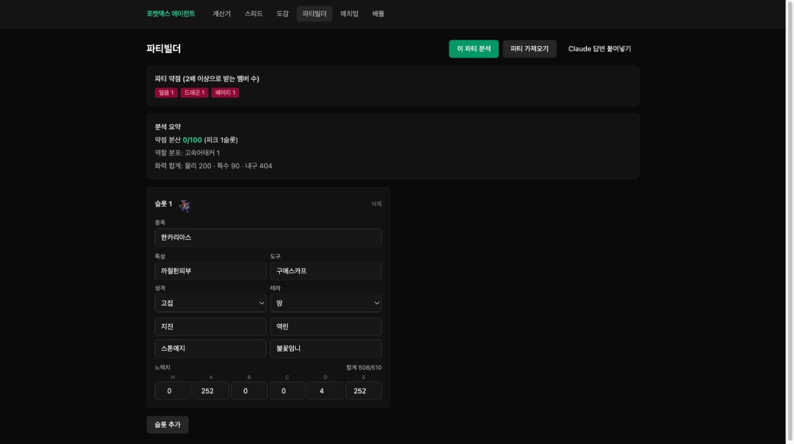
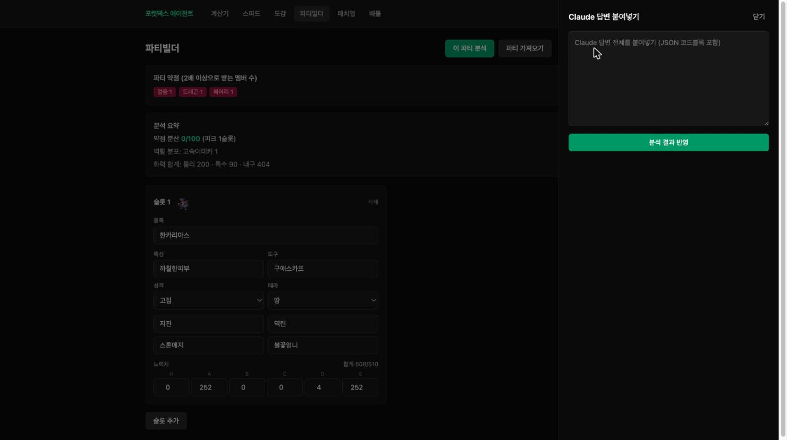

# 3편 — AI 분석 도입과 시행착오

웹앱이 도는 것을 확인한 뒤 본래 목표였던 AI 분석을 붙였다. "이 파티의 약점은", "이 상대 팀에
누구를 선출할까", "지금 이 상황에서 뭘 해야 하나" 같은 질문에 Claude가 답하게 만드는 일이다.
이 과정은 두 번의 방향 전환을 거쳤고, 둘 다 화면이 남아 있다.

## 첫 번째 시행착오: 클립보드 왕복 UX

초기 설계는 클립보드 paste 왕복이었다. 앱이 파티 정보를 직렬화해 클립보드에 담아주면,
사용자가 그걸 Claude 대화창에 붙여넣고, Claude의 답변을 다시 복사해 앱의 사이드패널에
붙여넣는 방식이었다. 아래가 그 시절의 실제 화면이다. 이 글을 쓰며 당시 커밋을 체크아웃해
다시 띄웠다.



"Claude 답변 붙여넣기"를 누르면 사이드패널이 열렸다. 답변 전체를 JSON 코드블록째 붙여넣으면
파싱해서 분석 결과로 반영하는 구조였다.



돌이켜보면 과한 우회였다. 사용자가 매번 복사·붙여넣기를 두 번 해야 했고, 응답 형식이 조금만
어긋나도 파싱이 깨졌다. 스크린샷의 노력치 입력(252/252/4)이 보여주듯 이때는 아직 본가 EV
체계이기도 했다 — 이 시기의 저장 데이터가 나중에 2편에서 다룬 마이그레이션 문제로 돌아온다.
결국 이 플로우는 통째로 폐기했다.

## 전환: 서버가 Anthropic을 직접 호출

대신 서버가 Anthropic API를 직접 호출하도록 바꿨다. 프롬프트 본문은 도메인 계층의 직렬화
함수가 만든다 — 파티·배틀 상태를 받아 결정론 분석(상성·스피드·데미지) 결과까지 붙여 텍스트로
펼치는 함수다. 응답은 느슨한 텍스트 파싱 대신 Structured Outputs로 스키마를 강제했다.

```ts
const response = await this.anthropic.messages.parse({
  model: MODEL_BY_TASK[task],
  max_tokens: 1500,
  system: [{ type: 'text', text: SYSTEM, cache_control: { type: 'ephemeral' } }],
  messages: [{ role: 'user', content: body }],
  output_config: { format: zodOutputFormat(ClaudeResponseSchema) },
});
```

응답 스키마(`ClaudeResponseSchema`)는 Zod로 정의하고, 정적 시스템 프롬프트에는 prompt
caching을 걸어 연속 호출의 입력 토큰 비용을 줄였다.

## 두 번째 시행착오: 한국어 고유명사를 지어낸다

가장 골치 아픈 문제는 모델이 한국어 고유명사를 fabricate하는 것이었다. 처음에 비용을 아끼려
가벼운 모델을 썼더니, 포켓몬 종족명·기술명·특성명을 그럴듯하게 지어내는 사례가 잦았다.
실제로 존재하지 않는 이름을 자신 있게 출력하는 것이라, 분석 결과 자체를 신뢰할 수 없게 만든다.

두 갈래로 대응했다.

첫째, 추천 계열 모델을 Sonnet으로 고정했다. 한국 SV 커뮤니티 어휘 정확도가 확연히 달랐다.
(이미지 OCR만은 정확도 때문에 별도로 Opus 비전을 쓴다.)

둘째, 응답에 2패스 명칭 보정을 넣었다. 모델이 응답에서 언급한 모든 고유명사를
`mentionedNames`로 함께 반환하게 하고, 이를 검증 사전과 대조한다. 사전에 없는 이름이
있으면 그 목록을 다시 모델에 주고 한 번 더 교정을 요청한다. 실제 코드는 이렇다.

```ts
// apps/server/src/advisor/advisor.service.ts
let unverified = parsed.mentionedNames.filter((name) => !isKnownTerm(name));
if (unverified.length > 0) {
  const correction = `\n\n## 명칭 교정 요청 (필수)\n다음 명칭은 검증 사전에 없다(음역·직역·오타·미존재 의심): ${unverified.join(', ')}\n정식 한국 명칭으로 바꾸거나, 확신이 없으면 해당 언급을 통째로 삭제하고 응답을 다시 작성하라. mentionedNames도 갱신하라.`;
  const retried = await this.callClaude(task, body + correction);
  const retriedUnverified = retried.mentionedNames.filter((name) => !isKnownTerm(name));
  if (retriedUnverified.length < unverified.length) {
    // 재시도가 더 깨끗하면 채택
  }
}
```

`isKnownTerm`은 PokeAPI에서 수집한 종족·기술·특성·도구 사전을 합쳐 만든 검증 함수다.
끝까지 검증을 통과 못 한 이름은 응답에서 "미확인 명칭"으로 분리해 사용자에게 그대로
노출하지 않는다.

시스템 프롬프트에도 못을 박았다. 영어 음역·직역 금지, 슬롯 번호 표현 금지(반드시 종족명),
모르는 상대 특성·기술은 추측 단정 금지 같은 규칙이다. 한국 커뮤니티에서 통용되는 표현으로만
답하게 만드는 것이 핵심이었다.

## 결과로 만들어진 AI 기능

이렇게 네 가지 AI 기능이 자리잡았다. 파티 정적 분석, 매치업 선출 추천, 실시간 배틀 조언은
Sonnet으로, 파티 화면 이미지에서 파티를 읽어내는 import는 Opus 비전으로 동작한다. 각 추천은
결정론 분석(상성·스피드·데미지) 결과를 프롬프트에 함께 실어, 모델이 근거 있는 답을 하도록
유도했다. (다섯 번째 AI 기능인 배틀 스크린샷 조언은 7편에서 다룬다.)

## 정리

AI를 붙이는 일은 "API를 호출한다"가 전부가 아니었다. 어떤 UX로 데이터를 주고받을지(왕복
폐기), 어떤 모델이 한국어 도메인에 맞는지(Sonnet), 그리고 모델이 틀린 이름을 낼 때 어떻게
잡을지(2패스 보정)가 실제 일의 대부분이었다. 다음 편은 이 모든 걸 떠받칠 백엔드를 NestJS로
다시 세운 이야기다.
