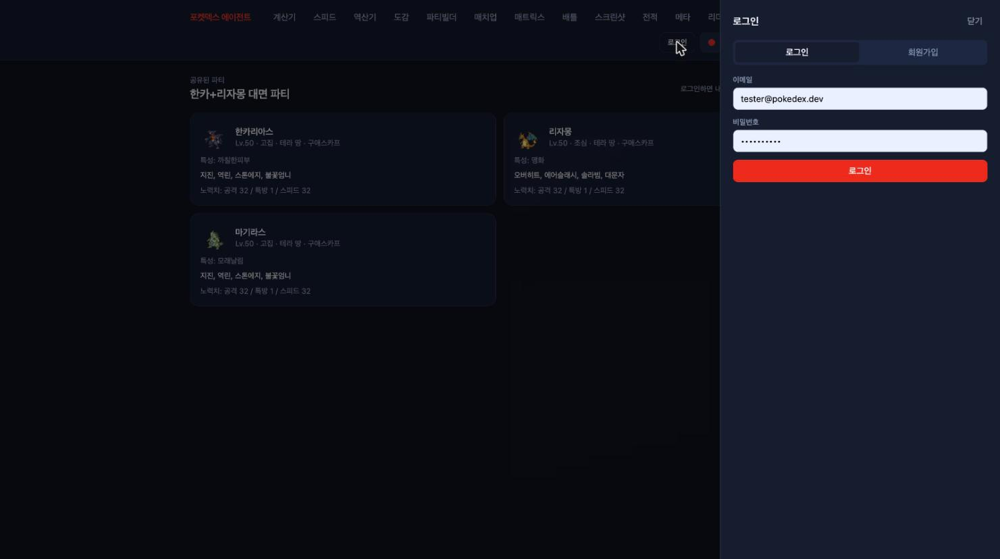
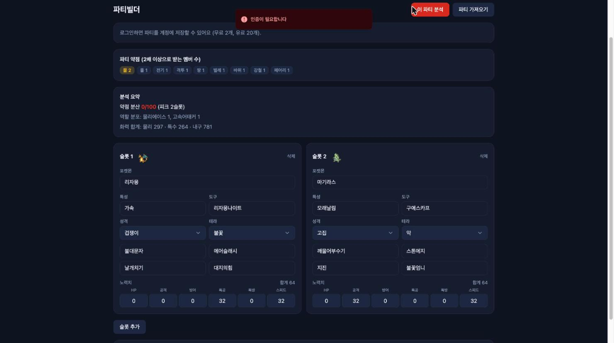
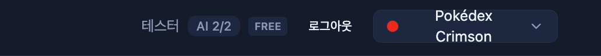
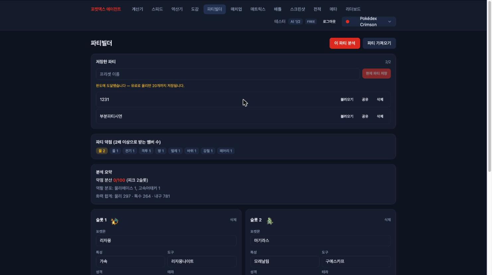
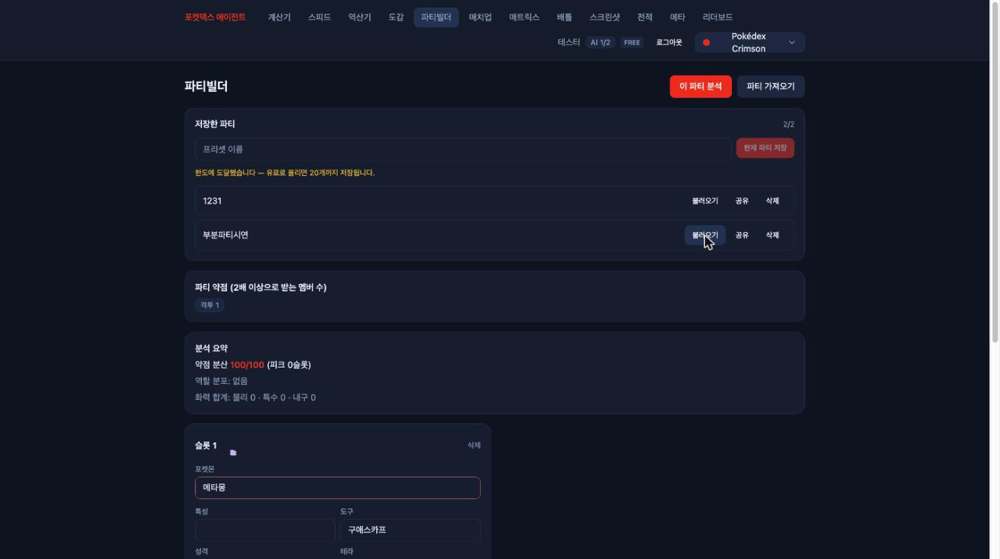
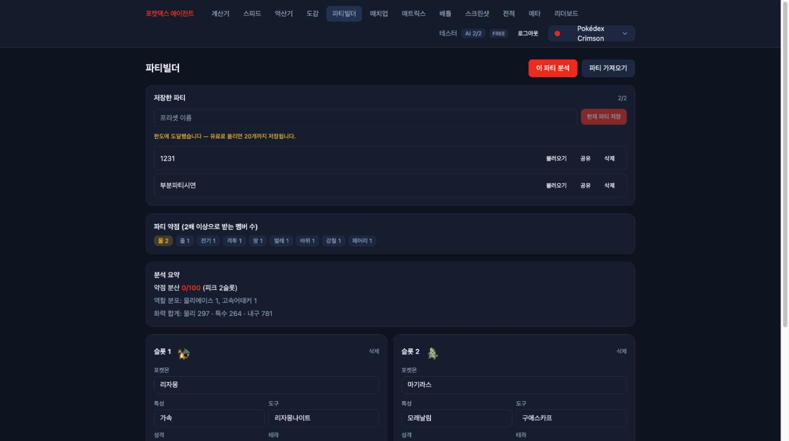
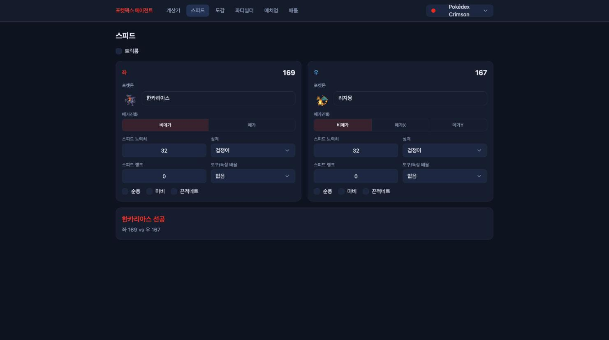
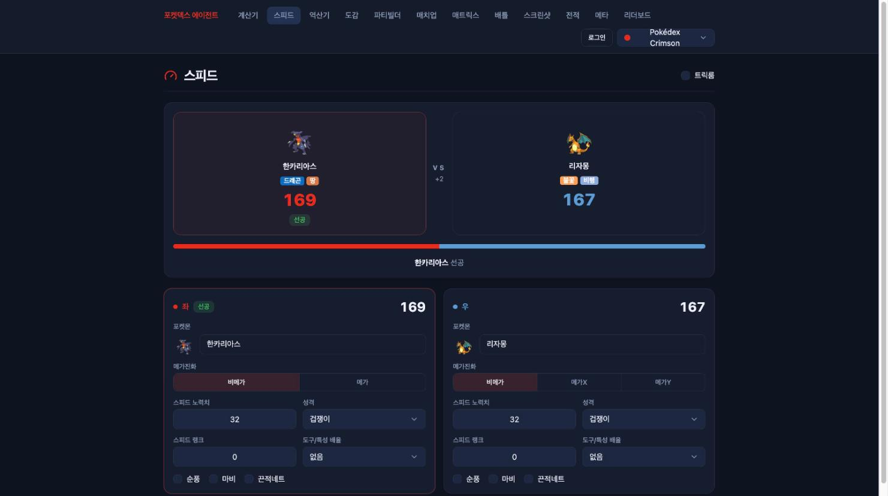
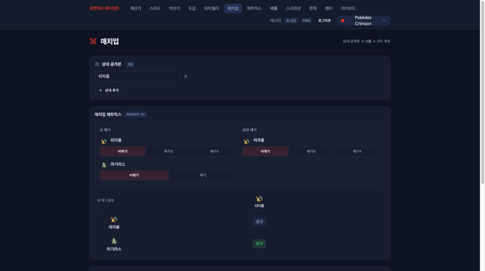
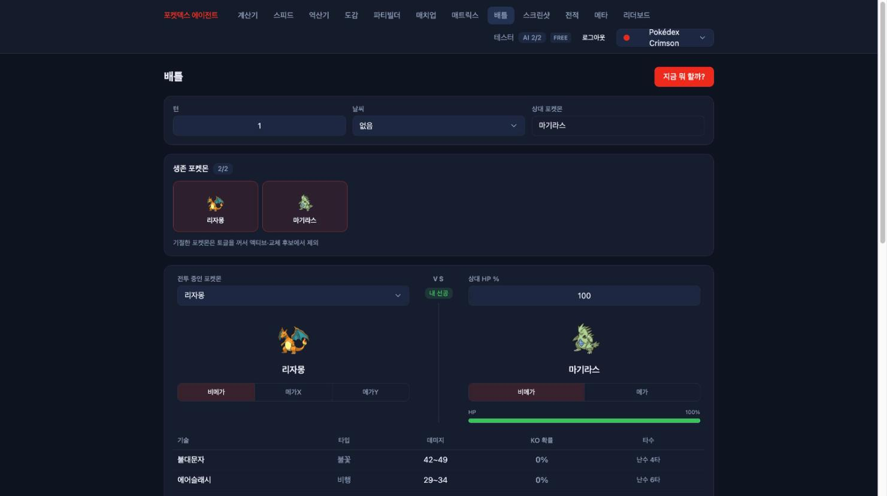

# 5편 — 프론트가 계정을 만나다

4편에서 만든 계정·프리셋·쿼터는 API로만 존재했다. 이 편은 그것들이 화면이 된 과정이다.
로그인 UI, 헤더의 쿼터 배지, 프리셋 저장, 그리고 같은 시기에 함께 손본 스피드 페이지
개편(전후 비교 포함)까지.

## 로그인은 페이지가 아니라 시트로

로그인을 별도 페이지로 만들지 않았다. 이 앱의 사용 흐름은 "계산하다가 → AI 기능이 필요해져서
→ 로그인"이지, 로그인이 목적지인 경우가 없다. 그래서 어느 화면에서든 헤더의 로그인 버튼을
누르면 우측에서 시트(Sheet)가 미끄러져 나오고, 로그인을 마치면 보던 화면에 그대로 남는다.



시트는 포털로 띄우고, 폼은 로그인·회원가입 탭 전환식이다. 성공하면 토큰을 저장하고 시트를
닫는다. 그게 전부다 — 인증 화면에 들이는 공은 최소로 하고, 머무는 화면을 지키는 쪽을 택했다.

로그인이 왜 필요한지는 사용자가 AI 기능을 누르는 순간 알게 된다. 비로그인 상태로
"이 파티 분석"을 누르면 서버의 JWT 가드가 401을 돌려주고, 화면엔 토스트가 뜬다. 결정론
기능(계산기·스피드·도감 등)은 끝까지 무인증이고, 비용이 드는 AI 기능만 게이트가 걸린다.



## 쿼터를 항상 보이게: 헤더 배지

4편의 일일 쿼터(무료 2회/유료 100회)는 서버에서 원자적으로 강제된다. 하지만 사용자가 한도를
"429 에러를 맞고 나서야" 알게 되면 최악이다. 그래서 로그인하면 헤더에 오늘 남은 질의 수를
상시 표시한다.



배지 컴포넌트는 단순하다. 쿼터 API를 구독하고, 남은 횟수가 0이면 경고색으로 바뀐다.
AI 기능을 쓸 때마다 쿼터 캐시를 무효화해 배지가 즉시 줄어든다. 실제로 파티 분석을 한 번
돌리면 2/2였던 배지가 그 자리에서 1/2로 바뀐다.



```tsx
// apps/client/src/features/quota/ui/QuotaBadge.tsx
// 헤더에 오늘 남은 AI 질의 수를 표시한다. 0이면 경고색.
export const QuotaBadge = () => {
  const token = useAuthStore((state) => state.token);
  const quota = useQuota();
  if (!token || !quota.data) {
    return null;
  }
  const { remaining, cap } = quota.data;
  const depleted = remaining <= 0;
  return (
    <span title="오늘 남은 AI 질의" className={depleted ? /* 경고색 */ '...' : '...'}>
      AI {remaining}/{cap}
    </span>
  );
};
```

## 프리셋 저장 — draft 타입이 두고두고 값을 한다

파티빌더의 "저장한 파티"가 서버 프리셋이 됐다. 여기서 2편의 설계 판단이 그대로 재사용됐다.
저장 포맷이 완성 파티가 아니라 부분 입력을 허용하는 draft 타입이라서, 종족만 정해둔 미완성
파티도 서버에 그대로 저장되고 그대로 복원된다. 서버 쪽은 이 draft를 jsonb 컬럼에 통째로
넣는다 — 클라이언트와 서버가 같은 Zod 스키마를 공유하니 가능한 일이다.

"부분 입력도 그대로"가 말뿐이 아니라는 걸 보여주는 화면이 있다. 종족은 메타몽, 특성은
빈 칸, 도구는 구애스카프만 정해둔 미완성 파티를 프리셋으로 저장해뒀다가 불러온 모습이다.
빈 칸은 빈 칸 그대로 돌아온다. 완성 스키마로 검증했다면 이 프리셋은 저장 단계에서 거부됐을
것이다.



티어 캡(무료 2개/유료 20개)은 서버가 트랜잭션으로 강제하지만, 화면에서도 한도에 닿으면
저장 버튼을 비활성화하고 이유를 말해준다. 업셀 문구는 한 줄이다.

```tsx
// apps/client/src/features/presets/ui/PresetManager.tsx
한도에 도달했습니다{user.tier === 'free' ? ' — 유료로 올리면 20개까지 저장됩니다' : ''}.
```



스크린샷의 "공유" 버튼이 하는 일(공유 링크·리더보드)은 7편에서 다룬다.

## 스피드 페이지 개편 — 전과 후

같은 시기에 스피드 페이지를 개편했다. 개편 전 화면부터 보자. 이 글을 쓰며 개편 직전 커밋을
체크아웃해 캡처했다.



기능은 다 있었다. 실수치도 정확했다. 그런데 결과가 회색 박스 속 텍스트 한 줄이라, "대면"이라는
긴장감이 전혀 없었다. 스피드 비교는 이 게임에서 가장 자주, 가장 급하게 확인하는 정보인데
화면이 그 무게를 못 담고 있었다.

개편 후에는 두 포켓몬을 VS 카드로 마주 세웠다. 스프라이트와 타입, 실수치 숫자를 크게 박고,
선공 쪽에 강조 테두리와 "선공" 뱃지를 달았다. 아래의 게이지 바는 양쪽 스피드의 비율을
시각화한다.



로직은 한 줄도 바뀌지 않았다. 같은 결정론 공식, 같은 169 대 167이다. 바뀐 건 정보의 위계뿐인데
페이지의 체감 완성도가 가장 크게 변한 개편이었다.

## 메가진화 표시 — 이름이 바뀌어야 메가다

챔피언스는 메가진화가 있다. 스피드·배틀·매치업 페이지에서 메가 폼을 선택하면 종족값만 바뀌는
게 아니라 표시 이름도 "리자몽"이 아니라 메가 폼 이름으로 바뀌어야 한다. 데이터에 메가 폼별
표시명을 두고, 화면의 모든 이름 표기가 그걸 거치게 했다. 매치업 페이지에서는 내 쪽과 상대
쪽의 메가 선택을 각각 토글로 받는다.



배틀 페이지도 같은 토글을 쓴다. 대면 카드에는 선공 표시와 기술별 데미지·KO 확률·타수까지
함께 보여, 한 화면에서 "지금 때리면 몇 타인가"가 끝난다.



## 정리

이 편의 일은 전부 "이미 있는 것을 보이게 만들기"였다. 쿼터는 4편에서 이미 강제되고 있었고,
draft 저장은 2편에서 이미 설계돼 있었고, 스피드 공식은 1편 그대로였다. 프론트 연동에서 실제로
한 일은 그것들의 자리와 위계를 정하는 일이었다. 다음 편은 커진 코드베이스의 거품을 걷어낸
리팩토링이다.
