# 7편 — 커뮤니티·AI 확장

백엔드와 계정이 자리잡자 올릴 수 있는 기능이 많아졌다. 방향을 정할 때 한 가지를 분명히 했다.
챔피언스 계산기 시장에는 이미 OP.GG와 포케모음 같은 강자가 있다. 계산기 기능으로 정면 승부하면
진다. 그래서 차별화 축을 **AI 조언, 한국 커뮤니티 어휘, 커뮤니티 데이터**로 잡았다. 이 편의
기능들은 전부 그 축 위에서 만들었고, 만드는 중에 버그도 둘 잡았다 — 둘 다 수정 전 화면을
당시 커밋으로 재현해 실었다.

## 공유 링크 — 가드 없는 컨트롤러라는 판단

저장한 파티를 읽기전용 공개 URL로 공유한다. 설계에서 막힌 지점은 "공개"였다. 다른 모든 계정
엔드포인트는 JWT 가드가 걸려 있다. 그런데 공유 뷰는 비로그인 사용자도 봐야 한다.

가드를 라우트별로 끄는 대신, **가드가 아예 없는 별도 컨트롤러**로 분리했다. 클래스 레벨 가드를
우회하는 가장 깔끔한 방법이다.

```ts
// apps/server/src/presets/shared-presets.controller.ts — JWT 가드 없음
@Controller('shared-presets')
export class SharedPresetsController {
  constructor(private readonly presets: PresetsService) {}
  @Get(':token')
  async get(@Param('token') token: string) {
    const preset = await this.presets.getByShareToken(token);
    return { name: preset.name, party: preset.party }; // 소유자 id·토큰·타임스탬프 비노출
  }
}
```

토큰은 프리셋에 귀속된 `shareToken`(nullable·unique)이고, 발급은 멱등(이미 있으면 그대로),
취소는 `null`로 되돌린다. 비로그인으로 연 화면은 읽기전용 카드만 보여준다.

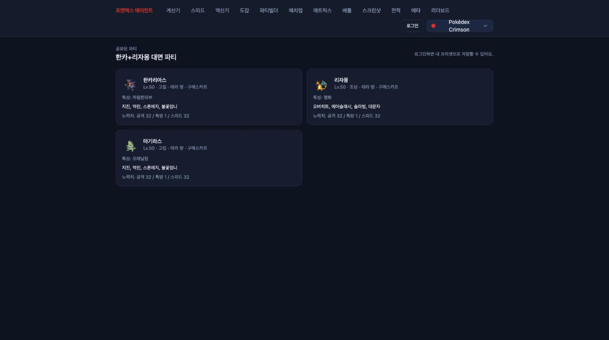

같은 화면을 로그인 상태로 열면 우상단에 "내 프리셋으로 복사" 버튼이 생긴다.

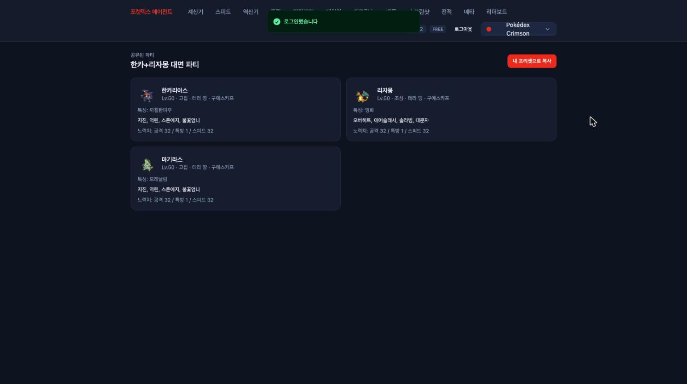

## 리더보드 — 인기순이 아니라 실제 복사수

리더보드를 만들 때 "인기순"은 조작되기 쉽다는 게 걸렸다. 그래서 순위를 **실제 채택 수(복사수)**로
잡았다. 공유본을 내 프리셋으로 복사할 때 원본의 복사 카운트를 한 트랜잭션 안에서 올린다.

```ts
// apps/server/src/presets/presets.service.ts
copyFromShare(userId: string, token: string): Promise<Preset> {
  return this.em.transactional(async (em) => {
    const source = await em.findOne(Preset, { shareToken: token });
    if (!source) throw new NotFoundException('공유된 프리셋을 찾을 수 없습니다');
    // ... 티어 캡 검사 (일반 create와 동일) ...
    const copied = em.create(Preset, { user, name: source.name, party: source.party });
    em.persist(copied);
    source.copyCount += 1;          // 복사 = 원본 채택 1
    return copied;
  });
}
// 리더보드: 공유된 것만, 복사수 내림차순
leaderboard(limit: number) {
  return this.em.find(Preset, { shareToken: { $ne: null } }, { orderBy: { copyCount: 'desc' }, limit });
}
```

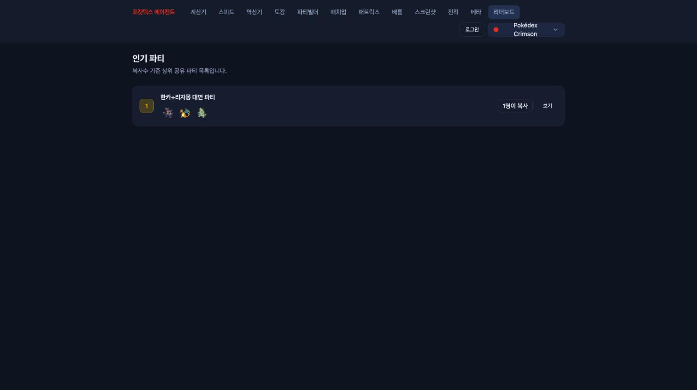

## 전적·코칭 — 앱이 배틀을 안 돌린다는 제약에서 출발

이 앱은 배틀을 직접 돌리지 않고 조언만 한다. 그래서 전적을 자동으로 딸 방법이 없다. 결론은
**사용자가 결과를 직접 적는 수동 일지**였다. 선발·기믹·승패·메모를 기록하면 전체 승률과
선발별 전적을 집계한다.

여기에 코칭을 얹었다. 단순 통계 표가 아니라, 표본이 충분한데 승률이 낮은 약점 상대를 짚어준다.

```ts
// apps/client/src/pages/log/lib/coaching.ts
const MIN_GAMES = 3, WEAK_RATE = 50;
const weakOpponents = stats.vsOpponent
  .filter((row) => row.games >= MIN_GAMES && row.winRate < WEAK_RATE)
  .sort((a, b) => a.winRate - b.winRate);
```

데모 전적 8판을 넣은 화면이다. 전체 50%인데 상대 선발별로 갈라 보면 마기라스에 1승 4패(20%),
크레세리아에 3승 0패다. 코칭이 정확히 마기라스를 약점으로 집어낸다.

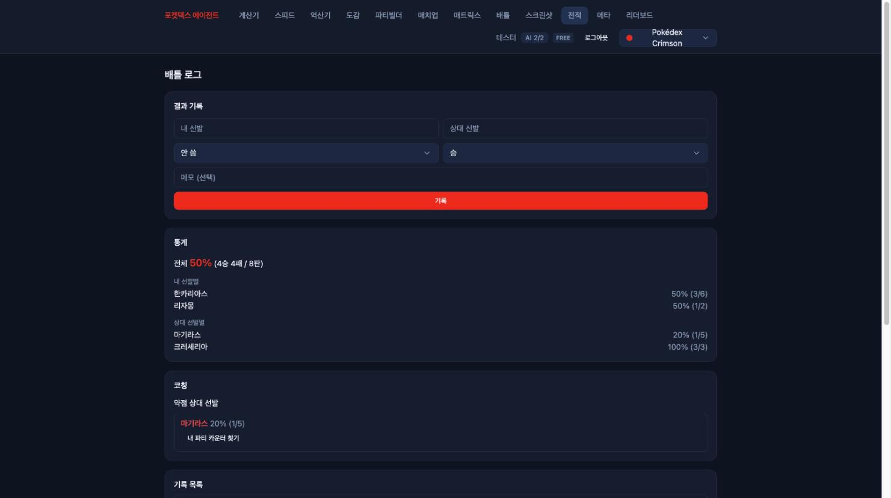

약점 상대 옆의 "내 파티 카운터 찾기"를 누르면, 결정론 카운터 엔진(무인증 `/counter`)을 내
프리셋 포켓몬 풀로 호출해 누가 잘 받는지까지 제안한다. AI 비용은 0이다.

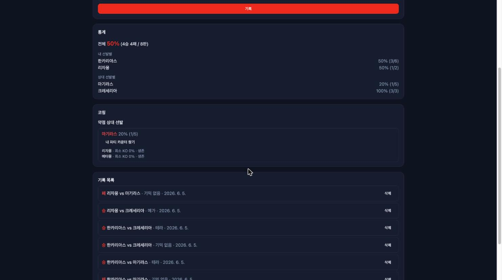

## 역산기 — 그리고 기본값 버그

계산기가 "이 노력치면 데미지 얼마"라면 역산기는 "이 목표를 만족하는 최소 노력치"를 찾는다.
세 모드(내구·스피드·화력) 모두 노력치 0~32를 전수 탐색한다. 챔피언스 포인트는 스탯당 33가지
값뿐이라 전수 탐색이 가장 단순하고 정확하다.

```ts
// 내구 역산: 특정 공격을 hits번 버티는 최소 HP/방어 노력
for (let hpEv = 0; hpEv <= 32; hpEv += 1)
  for (let defEv = 0; defEv <= 32; defEv += 1)
    if (calculateDamage(...).max * hits < hp) survivable.push({ hpEv, defEv, total: hpEv + defEv, ... });
```

여기서 스크린샷을 찍다가 버그를 발견했다. 기본 방어 포켓몬을 `도가스`로 박아뒀는데, 화면이
결과 없이 "포켓몬을 정확히 입력하라"만 떴다. 당시 커밋을 체크아웃해 재현한 화면이 이거다.

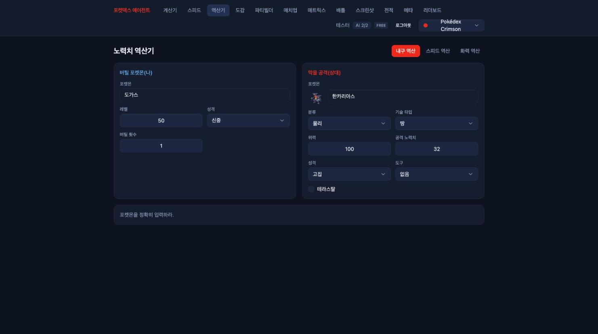

도감을 찍어보니 원인이 명확했다.

```
도가스 -> 없음
또가스 -> 또가스
또도가스 -> 또도가스
```

`도가스`는 내 오타였다. 정식명은 `또가스`다. 종족 검색 함수가 undefined를 반환하니 계산
자체가 안 됐던 것. 기본값을 `또가스`로 정정했다. 고친 뒤의 정상 화면은 이렇다 — 또가스가
한카리아스의 위력 100 바위 물리 기술(스톤에지 상정)을 2연타 확정으로 버티는 최소 노력치를
역산한 결과다.

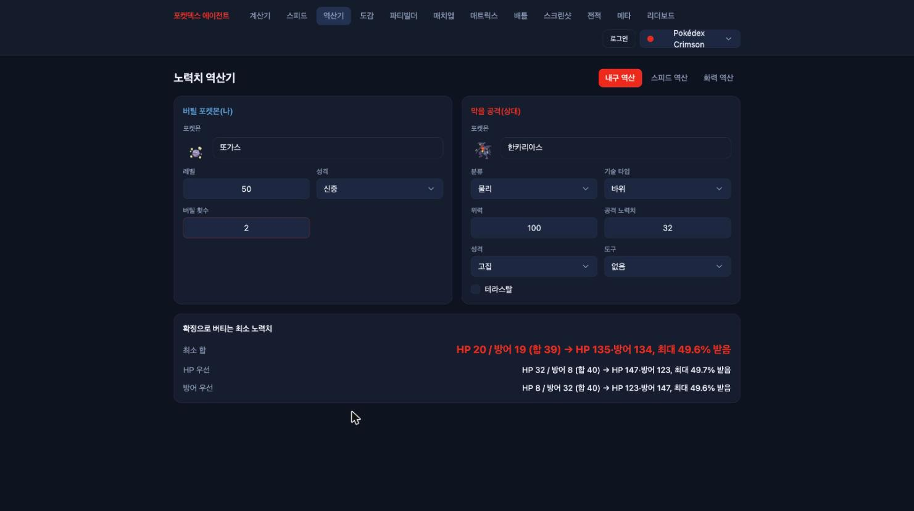

## 매치업 매트릭스 — 그리고 'hp' 크래시

내 팀과 상대 팀의 모든 짝을 한눈에 보는 상성표다. AI 없이, 무인증 `/team-select`(배틀 엔진의
pairwise 평가)를 그대로 호출해 결과를 그리드로 그린다.

스크린샷용으로 팀을 채우다가 두 번째 버그를 만났다. 종족명을 잘못 입력했더니 화면에 빨갛게
이렇게 떴다. 역시 당시 커밋에서 재현한 실물이다.

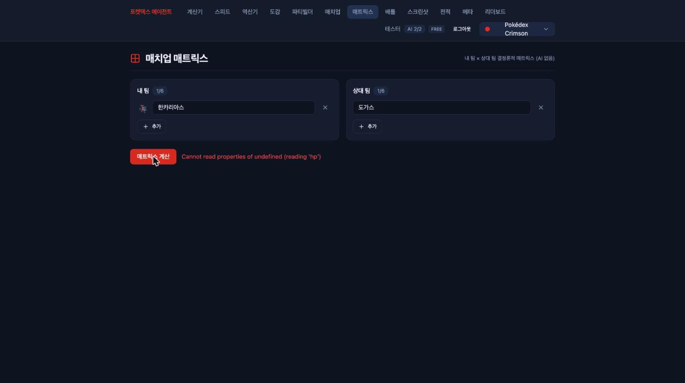

원인은 배틀 엔진이었다. 종족 검색에 실패하면 한국어 원문을 그대로 `@smogon/calc`에 넘기는데,
calc가 모르는 종족을 받으면 내부에서 `.hp`를 읽다 터진다. 컨트롤러에서 먼저 막도록 고쳤다.

```ts
// apps/server/src/battle/battle.controller.ts
const assertKnownSpecies = (names: ReadonlyArray<string>): void => {
  const unknown = [...new Set(names.filter((name) => name && !findPokemon(name)))];
  if (unknown.length > 0) throw new BadRequestException(`알 수 없는 포켓몬: ${unknown.join(', ')}`);
};
```

이제 같은 입력에 크래시 대신 사람이 읽을 수 있는 400이 돌아온다. 회귀 테스트도 넣었다.

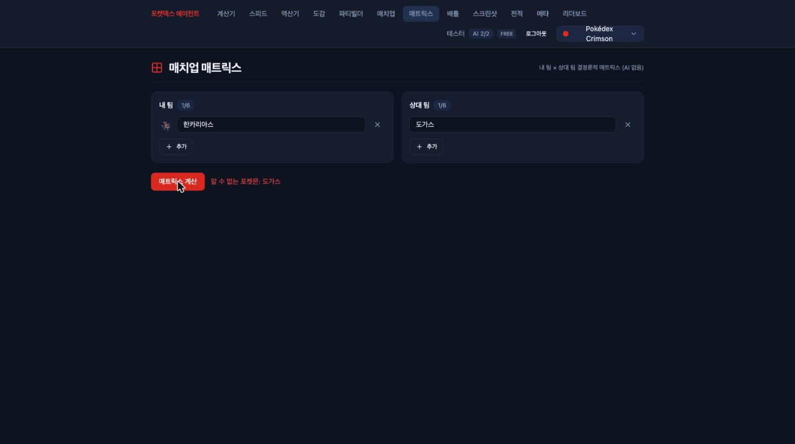

정상 입력일 때의 매트릭스는 이렇다. 행이 내 픽, 열이 상대 픽이고 셀마다 판정과 선공 여부를
표시한다. 행 점수순으로 추천 선두도 뽑아준다.

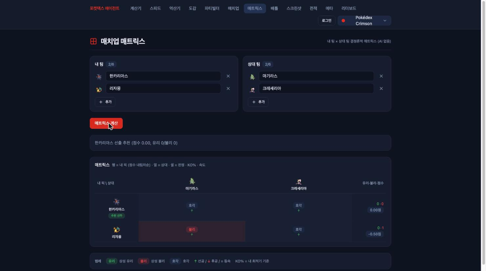

## 리빙 메타 — 데이터가 없으니 우리가 만든다

가장 공들인 기능이다. 챔피언스 메타 데이터는 어디에도 없다(Showdown·PokeAPI 미커버). 그래서
사용자들이 쌓는 전적을 익명 집계하면, 그 자체가 챔피언스 메타의 유일한 출처가 된다.

```ts
// apps/server/src/battle-log/battle-log.service.ts — 전 사용자 로그 익명 집계
async meta(limit = 15): Promise<MetaSummary> {
  const logs = await this.em.find(BattleLog, {});   // 유저 식별자 미포함
  // myLead·opponentLead별 게임수·승률·사용률, 기믹 분포 집계 ...
}
```

시드 전적 8판으로 띄운 화면이다. 인기 선발·상대 선발·기믹 분포가 실제 데이터로 채워진다.
표본이 8판뿐이라 지금은 장난감이지만, 출시 후 사용자가 쌓이면 이 페이지가 챔피언스 메타의
관측소가 된다.

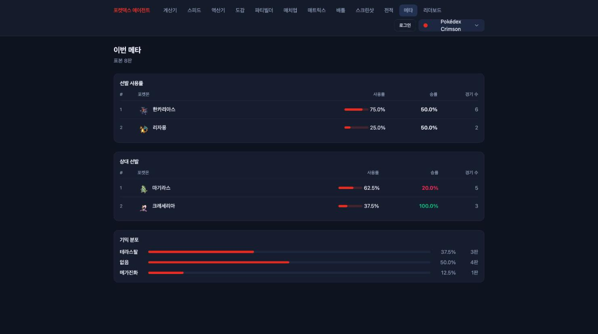

## 배틀 스크린샷 조언 — 계산기가 못 따라오는 한 수

마지막은 차별점의 정점이다. 배틀 화면 스크린샷을 올리면 경량 Sonnet 비전이 화면을 읽어 다음
한 수를 조언한다. 다른 AI 기능과 같이 로그인·일일 쿼터 게이트를 거치는 다섯 번째 AI
엔드포인트다.

```ts
// apps/server/src/advisor/battle-vision.service.ts
const response = await this.anthropic.messages.parse({
  model: 'claude-sonnet-4-6', max_tokens: 1200,
  system: [{ type: 'text', text: SYSTEM, cache_control: { type: 'ephemeral' } }],
  messages: [{ role: 'user', content: [
    { type: 'image', source: { type: 'base64', media_type: mediaType, data } },
    { type: 'text', text: userText },
  ] }],
  output_config: { format: zodOutputFormat(AdviceSchema) },
});
```

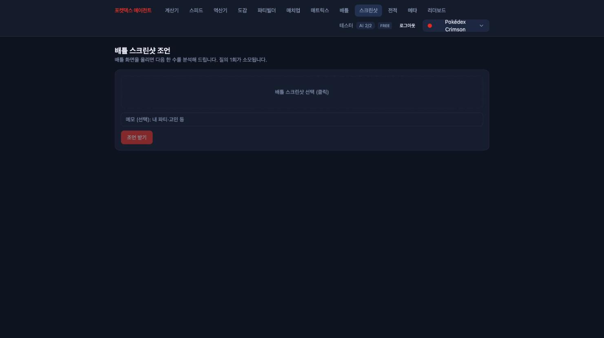

## 정리

이 편의 기능들은 따로 노는 게 아니라 한 방향을 가리킨다. 공유·리더보드·전적·메타는 커뮤니티
데이터를, 코칭·스크린샷 조언은 AI와 한국 어휘를 차별점으로 민다. 그리고 스크린샷을 찍는
단순한 작업조차 버그 둘(도가스 오타, 'hp' 크래시)을 드러냈다 — 실제로 화면을 띄워봐야만 보이는
것들이 있다. 마지막 편은 이 모든 과정에서 반복해 발목을 잡은 함정들의 목록이다.
