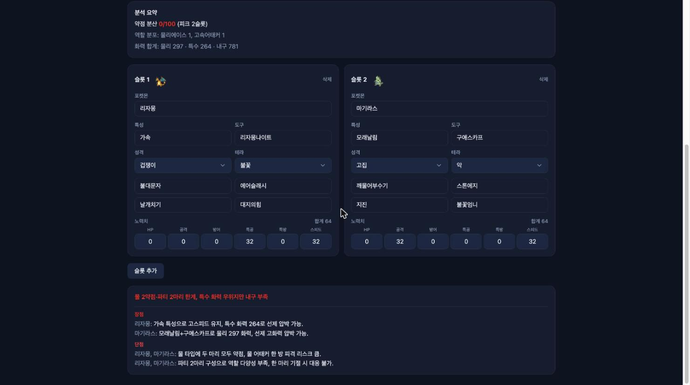

# 8편 — 겪은 버그와 교훈, 그리고 회고

마지막 편은 만드는 내내 반복해서 발목을 잡은 문제들과, 거기서 남은 교훈이다. 이번에도
가능한 한 실제 코드와 재현 출력으로 적는다.

## AI가 한국어 이름을 지어낸다 — 이 프로젝트 최대의 버그

3편에서 한 번 다뤘지만, 이 프로젝트에서 가장 오래 싸운 문제라 전말을 따로 정리한다.
증상은 세 갈래였다.

- **음역**: 영어 명칭을 한글로 소리만 옮긴다. 특성 '모래날림'을 '샌드스트림'으로, 도구
  '울퉁불퉁멧'을 '로키헬멧'으로 부르는 식이다. 둘 다 실제로 겪고 시스템 프롬프트에 금지
  예시로 박아 넣은 사례다.
- **직역·총칭**: '용의꼬리'를 '드래곤테일'로 쓰거나, '돌머리 계열'·'돌진계' 같은 한국
  커뮤니티에서 안 쓰는 뭉뚱그린 표현을 만든다.
- **창작**: 존재하지 않는 종족·도구·기술 이름을 자신 있게 만들어낸다. 가장 악질이다.

게임 도구라서 이게 치명적이다. 종족명 하나가 틀리면 사용자는 그 줄만 의심하는 게 아니라
분석 전체를 의심하게 된다.

### 당시 상황을 그대로 재현해봤다

말로 옮기는 대신, 이 글을 쓰며 당시 구성을 통째로 재현했다. 초기 구성은 세 가지가 지금과
달랐다. 모델이 비용 절약용 Haiku였고, 시스템 프롬프트가 단 5줄이었고, 명칭 보정이 없었다.
그 시절 프롬프트를 git에서 그대로 꺼내 보면 — 지금 보면 아찔한 줄이 하나 있다.

```ts
// 2026-05-28 보정 도입 직전의 실제 SYSTEM (5줄이 전부)
const SYSTEM = [
  '포켓몬 챔피언스 싱글배틀 분석가. 한국 SV 커뮤니티 어휘 (영어 직역 금지).',
  '응답은 details 2~4개로 압축, 파티 전체 관점. 포켓몬별 분산 금지.',
  'details.kind는 strength·weakness 위주. 근거(상성·수치) 포함, 단정형 금지.',
  "고유명사(...)는 절대 만들어내지 마라. ... 필요하면 슬롯 번호('1번', '2번 슬롯')로만 가리켜라.",
].join('\n');
```

"만들어내지 마라" 한 줄로 막힐 거라 믿었고, 심지어 **슬롯 번호로 부르라고 권장**까지 하고
있었다(이 표현은 나중에 정반대로 금지된다). 이 프롬프트 + Haiku + 보정 없음 구성을 재현
스크립트(`apps/server/scripts/repro-haiku-firstpass.mjs`)로 돌린 1차 응답 원문이다.
파티는 리자몽(리자몽나이트X)+한카리아스(구애스카프), 상대는 마기라스·크레세리아·메타몽이다.

```
- weakness | 파티 | 얼음·페어리·드래곤·물·전기 단점 구조로 상위 카운터(깜깜무스·플레임테일·단마카 등) 압박 강함.
- recommendation | 구성 | 1번 슬롯 리자몽의 리자몽나이트X는 메가 필수 픽이므로 유지하되,
  2번 슬롯 한카리아스의 구애스카프는 기합의띠·복슝열매 등으로 교체하여 내구 강화 고려.
mentionedNames: ["리자몽","한카리아스","리자몽나이트X","구애스카프"]
```

문제가 한 응답에 전부 들어 있다. **깜깜무스·플레임테일·단마카라는 포켓몬은 존재하지
않는다.** 도감은 1025종 전수를 수집했으므로(1편) 종족명에 한해서는 "사전에 없음 = 실존하지
않음"이 성립한다. 대조해보면 전부 탈락이고, 가장 가까운 실제 이름과도 한참 멀다.

```
깜깜무스   -> isKnownTerm: false | 근접 실제 종족: 파라스, 고오스
플레임테일 -> isKnownTerm: false | 근접 실제 종족: 식스테일, 나인테일
단마카     -> isKnownTerm: false | 근접 실제 종족: 단데기, 꼬마돌
```

옛 프롬프트가 권장하던 "1번 슬롯" 표현도 그대로 나왔다. 그리고 제일 교묘한 부분 —
창작한 세 이름이 **mentionedNames에는 빠져 있다.** 명칭 목록만 검증해서는 못 잡는다는
뜻이다.

### 검증하는 자를 검증하라 — 이 글을 쓰다 잡은 거짓 양성

고백할 것이 있다. 처음 이 절의 초고에서 나는 같은 응답의 "복슝열매"도 창작 도구로
분류했다. 검증 사전이 false를 돌려줬기 때문이다. 그런데 검수 과정에서 지적을 받고 다시
확인해보니 **복슝열매는 실존하는 열매(pecha-berry의 한국 정식명)이고, 심지어 챔피언스
합법 도구 카탈로그에도 들어 있었다.** 창작이 아니라 멀쩡한 추천이었던 것이다.

틀린 건 모델이 아니라 사전이었다. 명칭 검증 사전의 도구 부분이 루트 도구 사전(수집
카테고리 한정 328종)만 합치고 챔피언스 카탈로그를 빼먹고 있었다. 종족·기술·특성은 전수
수집이라 이런 구멍이 없는데 도구만 부분집합이었다. 이 거짓 양성은 블로그 원고만의 문제가
아니다 — 실서비스의 2패스 보정이 합법 도구를 "사전에 없으니 삭제하라"고 모델에게 요구하고
있었다는 뜻이다. 사전에 챔피언스 카탈로그를 합류시켜 고쳤다.

```ts
// packages/pokedex-core/src/lookup.ts — 검증 사전에 챔피언스 카탈로그 합류
const knownTerms = new Set<string>([
  ...pokedexByKo.keys(),
  ...moves.map((m) => m.ko),
  ...abilities.map((a) => a.ko),
  ...items.map((i) => i.ko),
  // 루트 items.json은 수집 카테고리 한정(328종)이라 챔피언스 합법 도구를 전부 덮지 못한다.
  // 예: 복슝열매(pecha-berry)는 챔피언스 카탈로그에 있지만 루트엔 없어 거짓 양성이 났었다.
  ...championsItemKos,
]);
```

```
수정 전: 복슝열매 -> isKnownTerm: false   (거짓 양성)
수정 후: 복슝열매 -> isKnownTerm: true
        깜깜무스·플레임테일·단마카 -> false  (창작 판정 유지)
```

교훈이 두 겹이다. 사전 기반 검증은 **사전의 커버리지가 곧 판정의 신뢰도**라서, "사전에
없음"을 "실존하지 않음"으로 읽으려면 그 사전이 전수인지부터 따져야 한다. 그리고 모델의
거짓말을 잡으려고 만든 장치가 거꾸로 모델의 옳은 말을 지우고 있을 수 있다 — 검증 장치도
검증 대상이다.

매치업 추천으로 돌리면 다른 갈래의 거짓말이 나온다. 같은 재현의 다른 실행에서 발췌했다.

```
- weakness | 리자몽 | 마기라스의 냉동펀치가 4배 약점이므로 선출 시 피해가 매우 크다
- weakness | 마기라스 | 한카리아스의 역린과 칼춤 조합에 제압당할 가능성이 높아 ...
- warning  | 한카리아스 | 선출된 2마리 모두 메가스톤을 가졌으나 ...
```

상대 마기라스의 기술은 입력에 없는데 냉동펀치·칼춤을 단정했고, 냉동펀치는 리자몽에게
4배가 아니라 1배다(불꽃이 얼음을 반감). 한카리아스가 든 건 메가스톤이 아니라 구애스카프다.
이름·사실·근거가 한꺼번에 무너진다.

### 해결: 네 겹의 방어

하나로는 안 잡혀서 겹겹이 쌓았다.

1. **모델 고정** — 추천 계열을 전부 Sonnet으로 올렸다. 같은 입력에서 위 같은 창작이
   사라지는 게 즉시 보였다. 코드에 이유를 주석으로 박아, 나중에 비용 아끼려 격하하는
   실수를 막았다.

   ```ts
   // 추천 시스템 모델은 한국 SV 어휘 정확도 우선으로 모두 Sonnet 4.6 사용.
   // (Haiku는 종족·도구·기술 이름을 fabricate하는 사례가 잦았음.)
   ```

2. **시스템 프롬프트 강화** — 5줄짜리가 10줄로 늘었다. 실패를 겪을 때마다 한 줄씩 추가된
   결과다. 음역 금지엔 실제 사례를 예시로 박았고('샌드스트림'→'모래날림',
   '로키헬멧'→'울퉁불퉁멧'), 슬롯 번호는 권장에서 **절대 금지**로 뒤집혔고, 모르는 상대
   기술·특성은 "지어내느니 '상대 특성 불명'으로 두는 게 낫다"로 못 박았다.

3. **프롬프트에 검증된 이름을 미리 주입** — 모델이 이름을 떠올릴 일 자체를 줄였다. 상대
   종족의 흔한 특성·기술을 우리 사전의 검증된 한국명으로 프롬프트에 실어주고, 도구 추천은
   챔피언스 도구 카탈로그를 통째로 주며 "이 리스트 밖 절대 금지"로 제한했다(3편의 프롬프트
   표본 참고).

4. **2패스 명칭 보정 + 미확인 표시** — 응답의 mentionedNames를 사전과 대조해, 탈락이 있으면
   그 목록을 주고 1회 재작성시킨다(코드는 3편). 그래도 남으면 응답에 미확인 명칭으로 분리해
   사용자에게 단정 표현으로 노출하지 않는다.

### 해결됐나

같은 파티를 현행 구성(Sonnet + 강화 프롬프트 + 주입 + 보정)으로 분석한 화면이다. 종족·특성·
도구 전부 실제 한국 명칭이고, 화력 수치는 프롬프트에 실어준 결정론 계산값을 그대로 쓴다.



단정은 피하겠다. 위 재현이 보여주듯 mentionedNames 누락형 창작은 목록 검증만으로는
구조적으로 못 잡는다. 그래서 마지막 방어선은 검증이 아니라 **애초에 떠올릴 필요를 없애는
3번(이름 주입·화이트리스트)**이고, 모델을 Sonnet으로 올린 뒤로는 일상 사용에서 창작 사례를
다시 보지 못했다. "프롬프트로 금지"는 약한 수단이고, "선택지를 좁히는 설계"가 강한 수단
이라는 게 이 싸움의 결론이다.

## lint 자동 수정이 import를 지운다

가장 자주 당한 함정이다. 6편에서 미사용 import 제거를 자동 수정 error 룰로 켰는데, 이게
편집 과정과 충돌했다. import를 한 편집에서 추가하고 그 사용처를 다음 편집에서 추가하면,
그 사이에 자동 수정이 "아직 안 쓰는" import를 지워버린다.

말로 하면 안 믿기니 그대로 재현해봤다. import만 먼저 추가한 파일에 `--fix`를 돌리면:

```
--- before:
import { actualStat } from '@pokedex-agent/pokedex-core';

// 다음 편집에서 actualStat을 쓸 계획이었다
export const placeholder = 1;

$ npx eslint --fix src/demo-lint-trap.ts

--- after:
// 다음 편집에서 actualStat을 쓸 계획이었다
export const placeholder = 1;
```

import 줄이 **에러도 경고도 없이** 사라졌다. 이 상태에서 다음 편집이 `actualStat`을 쓰는
코드를 추가하면 빌드가 이렇게 깨진다.

```
$ npx tsc --noEmit
src/demo-lint-trap.ts(2,19): error TS2304: Cannot find name 'actualStat'.
```

내가 쓴 적 없는 삭제가 원인인데 에러는 내가 방금 쓴 코드에서 난다. 지운 쪽(lint)과 깨지는
쪽(빌드)이 달라서 원인을 한참 못 찾는다.

해결은 편집 순서를 뒤집는 것이었다. 사용처를 먼저 넣고 import를 마지막에 추가하거나,
새 코드는 import와 사용처를 한 편집에 같이 쓴다. 룰 자체는 유지했다 — 진짜 미사용 import를
자동으로 치워주는 가치가 더 크고, 함정은 습관으로 피할 수 있기 때문이다.

## 전역 집계 테스트가 공유 DB에서 깨진다

리빙 메타 테스트가 처음엔 실패했다. 메타는 전체 사용자의 전적을 집계하는데, 통합 테스트들이
같은 Postgres를 공유하다 보니 **다른 spec이 남긴 로그가 집계에 섞였다.** 게다가 상위 N개만
보여주는 절단 때문에, 테스트가 심은 시드가 다른 데이터에 밀려 잘려나가면 단언이 통째로
빗나갔다.

기능 버그가 아니라 테스트 격리 문제였다. 트랜잭션 롤백 격리는 "내가 만든 데이터"는 지켜주지만
"남이 남긴 데이터가 안 보이는 것"은 보장하지 않는다 — 전역 집계는 후자가 필요했다. 그래서
테스트 파일이 순차 실행되는 점을 이용해, 집계 단언 직전에 테이블을 비우고 시작하게 했다.
실제 테스트 코드다.

```ts
// apps/server/test/meta.spec.ts
it('여러 사용자의 로그를 통합해 집계한다', async () => {
  // 전역 집계라 다른 spec이 남긴 로그가 섞이고 상위 N 절단에 시드가 밀릴 수 있다.
  // 파일 순차 실행(fileParallelism:false)이므로 동시 writer 없이 안전하게 비운다.
  await app.get(MikroORM).em.fork().getConnection().execute('delete from battle_logs');
  const tokenA = await newUser();
  const tokenB = await newUser();

  // 사용자 A: 뮤우로 2승 1패
  await addLog(tokenA, { myLead: '뮤우METASPEC', opponentLead: '셀비', gimmick: 'none', result: 'win' });
  // ... 사용자 B: 세레비로 1승 (기믹 mega)
```

시드 종족명에 `METASPEC` 접미를 붙인 것도 같은 이유다 — 혹시 비우기가 빠진 채 돌아도
다른 spec의 데이터와 절대 충돌하지 않는 이름을 쓴다. 격리는 한 겹보다 두 겹이 낫다.

## 로컬 비전 모델이 메모리를 터뜨린다

이미지에서 파티를 읽는 기능은 처음에 로컬 비전 모델(Ollama, Qwen 2.5 VL 계열)로 시도했다.
비용을 아끼려는 의도였다. 그런데 M4 Max(통합 메모리 36GB)에서 30b급 모델을 올리니 메모리
부족으로 프로세스가 죽었다. 실험 끝에 이 머신의 한계는 8B급이었고, 그 크기로는 한국어 게임
UI의 OCR 정확도가 쓸 만한 수준이 못 됐다. 종족명 하나를 잘못 읽으면 그 뒤의 분석 전체가
무의미해지는 기능이라, 결국 이미지 import는 정확도를 위해 Opus 비전으로 갔다. "로컬이라
공짜"는 정확도 요구가 낮은 작업에서만 성립한다는 걸 배웠다.

## 워크스페이스 패키지가 컴파일 서버에서 안 읽힌다

4편에서도 다뤘지만, 실제 변경을 보여주며 교훈으로 다시 적는다. 도메인 패키지들이 처음엔
raw `.ts`를 그대로 export하고 있었다.

```diff
 // packages/pokedex-core/package.json — NestJS 전환 커밋에서의 변경
-  "main": "./src/index.ts",
+  "main": "./dist/index.js",
+  "types": "./dist/index.d.ts",
   "exports": {
-    ".": "./src/index.ts",
-    "./data/*": "./data/*.json",
-    "./formula": "./src/formula/index.ts"
+    ".": { "types": "./dist/index.d.ts", "default": "./dist/index.js" },
+    "./node": { "types": "./dist/paths.d.ts", "default": "./dist/paths.js" },
+    "./data/*": "./data/*.json"
   },
```

개발 중에는 문제없었다 — 클라이언트는 Vite가, 옛 서버는 tsx 런타임이 `.ts`를 즉석에서
변환해줬기 때문이다. 그런데 NestJS 서버는 **컴파일된 JS**로 돌고, node는 `.ts` import를
모른다. tsup으로 자기완결 ESM 번들 + 번들된 `.d.ts`를 내보내고, 브라우저 안전 메인 엔트리와
node 전용 엔트리를 분리하고 나서야 풀렸다. 대신 패키지를 수정하면 소비자가 쓰기 전에 빌드가
선행돼야 하는 비용이 생겼다(turbo가 의존 빌드를 걸어주지만 dev 모드는 수동 한 번 필요).
모노레포에서 "내 컴퓨터에선 됨"이 가장 안 통하는 영역이 패키지 경계라는 걸 절감했다.

## 데이터 피벗이 전부를 흔든다

SV에서 챔피언스로 바꾼 결정은 노력치 한 숫자(0~252 → 0~32)에서 끝나지 않았다. 데미지 공식,
검증 스키마, 저장된 데이터 마이그레이션(2편), 입력 UI까지 연쇄로 흔들렸다. 다행히 도메인을
결정론 계층으로 분리하고 테스트로 고정해둔 덕에, 흔들리는 범위가 그 계층 안으로 한정됐다.
피벗을 견디는 건 결국 경계 설계였다.

## 회고: 다음은 기능이 아니다

지금 기능은 충분히 많다. AI 다섯 종, 공유·리더보드·전적·코칭·역산기·매치업 매트릭스·리빙
메타까지. 그런데 솔직히 다음 병목은 기능이 아니다. 이 모든 게 아직 머지되지 않은 브랜치 안에만
있고, 배포도 카카오·네이버 로그인도 없다. 도로가 없는데 차만 계속 튜닝한 셈이다.

그래서 다음 우선순위는 둘이다. 실제 로그인(한국 사용자는 이메일+비번 가입을 잘 하지 않는다)과
배포. 인증을 포트/어댑터로 추상화해둔 덕에 카카오·네이버는 어댑터만 추가하면 된다. 배포가
되어야 공유·리더보드·메타라는 커뮤니티 선순환이 비로소 돌기 시작한다.

기능을 더 얹는다면, 새 기능보다 이미 만든 것을 연결해 복리로 만드는 쪽이 낫다고 본다. 리빙
메타 집계를 AI 추천에 먹여, 모델이 추측 대신 실제 커뮤니티 승률을 근거로 답하게 만드는 것이다.
그게 데이터 해자의 진짜 페이오프다.

## 마치며

개인 도구 하나를 만들면서 도메인 모델링, AI 연동, 백엔드 전환, 리팩토링, 그리고 수많은 작은
함정을 지났다. 가장 크게 남은 교훈은 두 가지다. 흔들릴 것 같은 부분(도메인·데이터)을 순수
계층으로 분리해 테스트로 고정해두면 피벗도 견딘다는 것, 그리고 감으로 손대지 말고 항상 증거로
바꾼 뒤 손대라는 것. 다음 글은 배포와 로그인을 붙여 실제 사용자를 받은 이야기가 되길 바란다.
