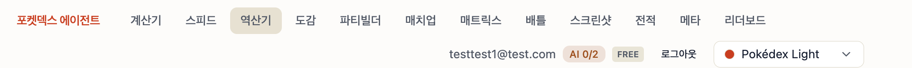
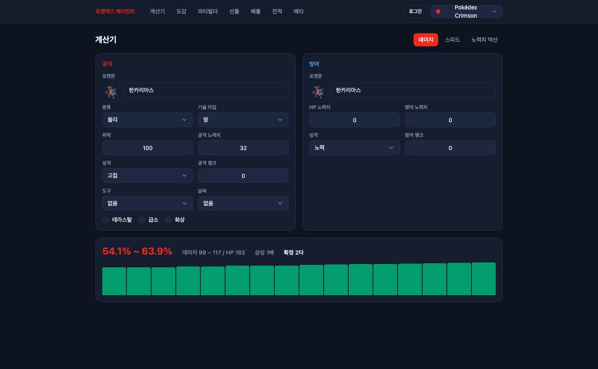
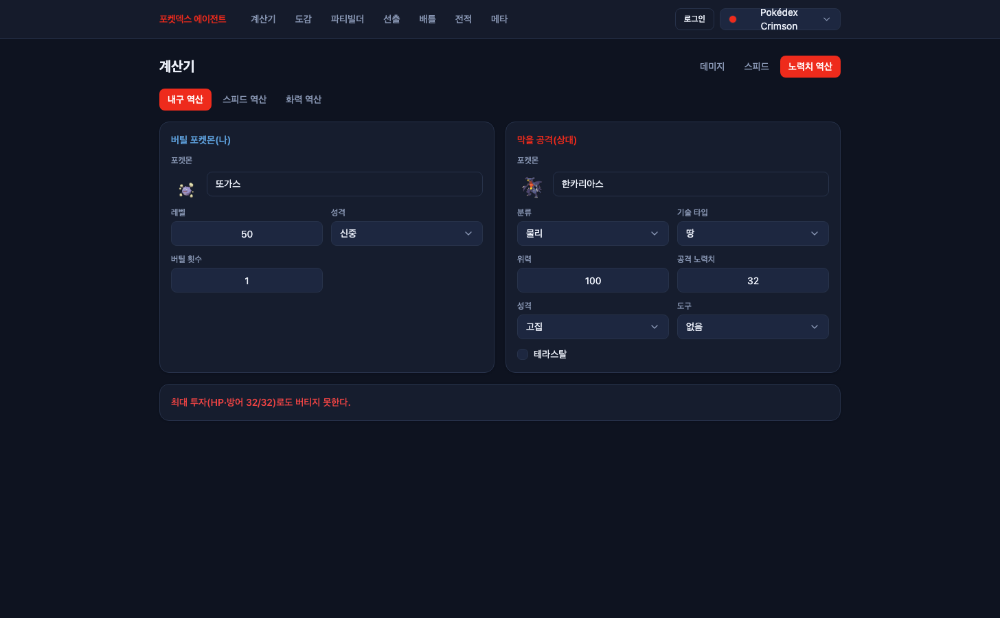
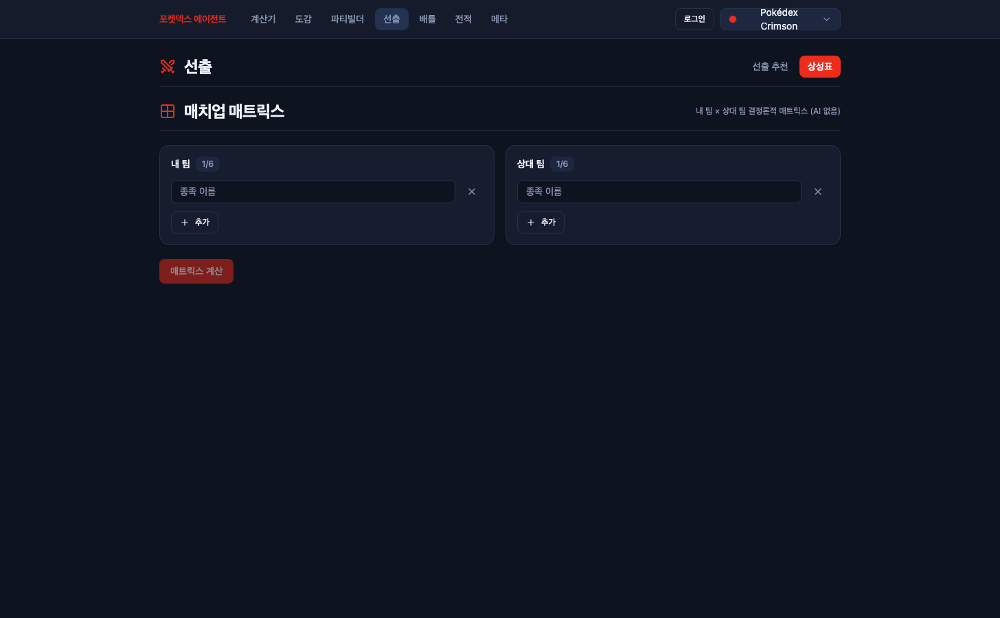
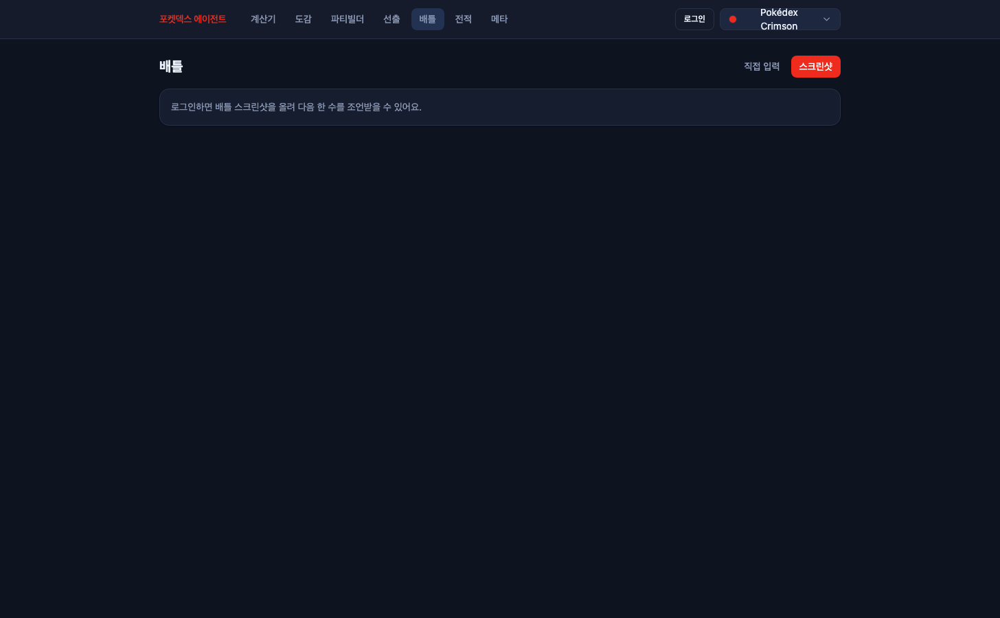
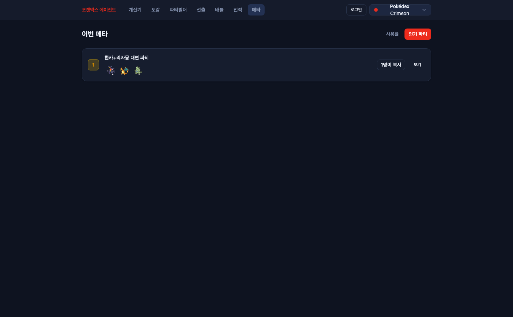

# 10편 — 내비게이션 12개를 7개로: 정보 구조 개편

기능을 붙일 때마다 탑내비게이션에 항목을 하나씩 추가해 왔더니, 어느새 12개가 됐다.



계산기, 스피드, 역산기, 도감, 파티빌더, 매치업, 매트릭스, 배틀, 스크린샷, 전적, 메타,
리더보드. 만든 사람인 나조차 "역산기는 뭐고 매치업은 뭐고 매트릭스는 뭐지" 싶은 상태.
처음 온 사용자가 납득할 리 없다. 출시 전에 정보 구조를 손봤다.

## 1. 같은 질문에 답하는 페이지들

12개를 펼쳐 놓고 "사용자가 어떤 질문을 들고 오는 페이지인가"로 다시 묶어 봤더니
중복이 보였다.

- **매치업 페이지 안에 이미 '매치업 매트릭스' 섹션이 있었다.** 단독 매트릭스 페이지는
  같은 상성표를 파티 없이 임의 팀으로 돌리는 변형이었다.
- **배틀과 스크린샷은 같은 질문이다** — "지금 뭐 할까?". 상황을 손으로 입력하느냐
  스크린샷으로 올리느냐, 입력 방식만 다르다.
- **전적과 메타도 같은 데이터다** — 배틀 일지의 집계. 내 통계냐 전체 통계냐의 차이.
- **리더보드는 내용상 '인기 파티 순위'다.** 별도 개념이 아니라 커뮤니티가 공유한
  파티를 복사수 순으로 보는 것.

역산기도 도마에 올랐다. "결국 계산기랑 같은 거 아닌가?"라는 질문에 대한 답은:
기능은 다르다. 계산기는 노력치를 주면 데미지가 나오는 정방향이고, 역산기는 "이
공격을 버티려면 몇 포인트 줘야 하나"를 푸는 역방향이다. 실전에서 묻는 질문이 달라서
기능은 살릴 가치가 있다. 다만 같은 공식 도메인이므로 **별도 페이지일 이유가 없다.**

## 2. 7개로

결론은 7개 항목 + 페이지 내 탭이다.

| 항목 | 탭 |
|------|----|
| 계산기 | 데미지 · 스피드 · 노력치 역산 |
| 도감 | — |
| 파티빌더 | — |
| **선출** (구 매치업) | 선출 추천 · 상성표 |
| 배틀 | 직접 입력 · 스크린샷 |
| 전적 | — |
| 메타 | 사용률 · 인기 파티 |



이름도 손봤다. "매치업"은 그 페이지가 실제로 하는 일 — 6마리 중 3마리 고르고 선두
정하기 — 의 커뮤니티 표준 용어인 **선출**로 바꿨다. "매트릭스"는 **상성표**로,
"리더보드"는 **인기 파티**로. 외래어를 한국 커뮤니티가 실제로 쓰는 말로 바꾸는
것만으로 설명이 필요 없어진다.

탭 상태는 URL search param(`?tab=`)에 둬서 딥링크가 살아 있고, 사라진 옛 경로
(`/speed`, `/ev-calc`, `/matrix`, `/battle-vision`, `/leaderboard`)는 전부 해당
탭으로 리다이렉트한다. 북마크와 공유 링크가 깨지지 않는다.






## 3. 탭 셸이 깨뜨린 테스트들

페이지가 search param을 읽기 시작하자, 페이지 컴포넌트를 라우터 없이 직접 렌더하던
스펙 3개가 일제히 죽었다.

```
TypeError: Cannot read properties of null (reading 'stores')
 ❯ useSearch .../react-router/src/useSearch.tsx:96:9
 ❯ MatchupPage src/pages/matchup/ui/MatchupPage.tsx:17:19
```

라우터 컨텍스트가 없으니 당연하다. 앱 라우팅 스펙이 이미 쓰던 패턴 — 메모리
히스토리로 실제 라우터를 만들어 감싸기 — 으로 교체했다. 부수입도 있었다. 이제
스펙이 `?tab=matrix` 같은 URL로 직접 진입해 탭 배선까지 검증한다.

고치자마자 두 번째 함정. 같은 이름의 헤딩이 두 개가 됐다.

```
TestingLibraryElementError: Found multiple elements with the role "heading" and name "선출"
```

탭 셸의 페이지 제목 h1이 '선출'인데, 선출 추천 탭 안에 "내가 고른 3마리" 섹션
헤딩(h2)도 '선출'이었다. 단언에 `level: 1`을 더해 페이지 제목만 집게 했다.

배틀 쪽은 반대 문제였다. 셸 제목이 '배틀 조언'으로 들어가고 직접 입력 탭 안에 옛
h1 '배틀'이 그대로 남아, 한 화면에 h1이 두 개였다. 제목은 셸이 갖고('배틀'), 탭
안쪽 헤더는 추천 트리거 버튼만 남겼다.

## 4. 작은 결정: validateSearch에 zod를 안 쓴 이유

팀 룰은 "validateSearch에는 Zod"인데, 이 프로젝트의 클라이언트는 zod 의존성이
없었다(서버와 코어만 쓴다). 탭 하나 검증하자고 패키지를 추가하는 건 — 패키지 추가는
사용자 승인 사항이기도 하고 — 같은 룰 문서의 다른 조항("간단한 검증은 직접 구현")이
정확히 이 케이스다. enum 화이트리스트에 없으면 기본 탭으로 떨어지는 함수 하나로 끝.

## 5. 캡처 비하인드

이 글의 "개편 후" 스크린샷은 헤드리스 Chrome으로 찍었다. 처음엔 브라우저 자동화로
열린 탭을 OS 화면 캡처로 찍으려 했는데, 캡처 시점에 사용자(나)가 같은 창의 다른
탭에서 블로그를 쓰고 있어서 남의 작업 화면이 찍혀 나왔다. 작업 중인 브라우저 창을
빼앗아 탭을 강제 전환하는 건 도구가 할 짓이 아니라서, 포커스와 무관한 헤드리스
렌더(`--headless --screenshot`)로 전환했다. localhost 페이지 캡처엔 이쪽이 훨씬
깔끔하다.

## 검증

- 테스트 36개 통과(탭 진입 스펙 2개 추가), lint 0 errors, type-check·build 통과
- 옛 경로 5종 리다이렉트와 탭 딥링크 실화면 확인(위 캡처들이 그 증거)
